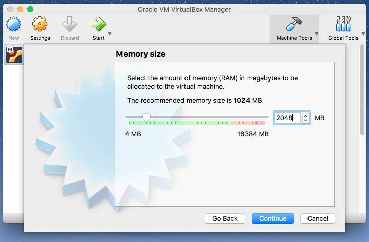

# Set up your Ruby on Rails Learning Environment

In an effort to assist students in the learning process, we will all be using the same development environment set up using [Virtual Box] and [Ubuntu 16.04].

## Ubuntu
Click [here][Ubuntu 16.04] to go download Ubuntu

## Virtual Box
Click [here][Virtual Box] to go download the version of virtual box for your system.

1. create a new virtual machine


2. select which operating system and architecture you want to use ( Linux, Ubuntu 64bit )


3. select the amount of RAM you want your VM to have



4. create a virtual hard disk


5. select which kind of virtual hard disk you want to use


6. select how the hard disk will be stored


7. select the virtual hard disk location and size


8. go to the settings for your virtual machine


9. go to the storage tab and click on the add disk button to add your copy of Ubuntu


10. `click` the green 'start' button to start the machine.


## Tools for the Job
Once you have installed Ubuntu you will need to set up the tools we will use throughout this course.

### Atom Text editor
source [atom][atom]
```bash
sudo add-apt-repository ppa:webupd8team/atom
sudo apt update
sudo apt install atom
```

### Ruby Version Manager (RVM) for Ubuntu
source [rvm][atom]
```bash
sudo apt install software-properties-common
sudo apt-add-repository -y ppa:rael-gc/rvm
sudo apt update
sudo apt install rvm
```
#### Install Ruby
```bash
rvm install 2.4.1
```
### Git source control for Ubuntu
Before you install `git` run
```bash
git --version
```
If what is prited out resembles `git version 2.14`, skip to configure git.


#### Install Git
source [git][git]
```bash
sudo apt update
sudo apt install git
```

#### Configure Git
```bash
git config --global user.name "Your Name Here"
git config --global user.email "your_email@here.com"
```
### Postgresql for Ubuntu
source [postgres][postgres]
```bash
sudo apt update
sudo apt install postgresql postgresql-contrib
```
### Install Rails
#### Install dependencis for NOKOGIRI
```bash
sudo apt install -y build-essential patch ruby-dev zlib1g-dev liblzma-dev libpq-dev
```

#### Install NodeJS
```bash
curl -sL https://deb.nodesource.com/setup_9.x|sudo -E bash -
sudo apt install nodejs
```
#### Install Yarn
source [yarn][yarn]
```bash
curl -sS https://dl.yarnpkg.com/debian/pubkey.gpg|sudo apt-key add - 
echo "deb https://dl.yarnpkg.com/debian/ stable main"| sudo tee /etc/apt/sources.list.d/yarn.list
sudo apt update
sudo apt install yarn
```


[Virtual Box]:(https://www.virtualbox.org/wiki/Downloads)
[Ubuntu 16.04]:(http://releases.ubuntu.com/16.04/)
[atom]:(http://tipsonubuntu.com/2016/08/05/install-atom-text-editor-ubuntu-16-04) 
[rvm]:(https://github.com/rvm/ubuntu_rvm)
[git]:(https://www.digitalocean.com/community/tutorials/how-to-install-and-use-git-on-ubuntu-16-04)
[postgres]:(https://www.digitalocean.com/community/tutorials/how-to-install-and-use-postgres-on-ubuntu-16-04)
[yarn]:(http://g3ortega.com/rails/2017/05/30/rails-5-1-and-forward-yarn-on-rails.html)
